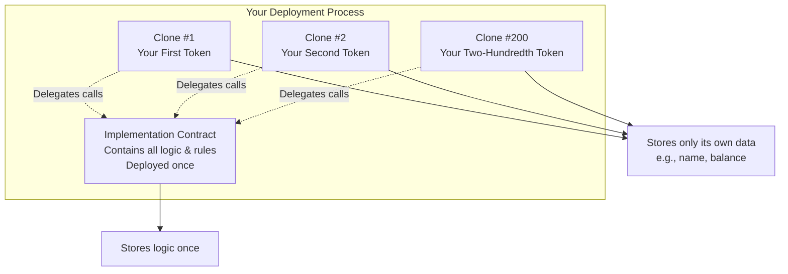

OpenZeppelin Clones is a **gas efficiency tool** that allows you to deploy hundreds of contracts (like your 200 tokens) for a fraction of the usual cost. Instead of deploying identical code over and over, it creates lightweight "copies" that all reference a single master contract.

Here is a simple analogy to help visualize the concept:



### ⚙️ How It Works: The Technical Overview

The Clones system is the implementation of **EIP-1167** (Minimal Proxy Contract), a standard developed to make cloning contracts cheap and efficient.

1.  **The Master Copy**: You first deploy one "master" or "implementation" contract. This contract holds all the logic for your token (how transfers work, how balances are updated, etc.).

2.  **The Lightweight Clones**: Instead of deploying the full master code again for each of your 200 tokens, you use the `Clones` library to deploy tiny "proxy" contracts. These proxies are incredibly small (as little as 55 bytes of code). When a user interacts with a clone, it automatically forwards the call to the master contract to execute the logic.

3.  **Separate Data**: Each clone is an independent contract with its own storage. This means **Clone #1 can be named "My Dollar" and hold 1,000 tokens**, while **Clone #2 can be named "Your Euro" and hold 0 tokens**. They share the same rules (the logic) but maintain their own bank accounts (the data).

### 💰 Why Use Clones for Your Stablecoin Project?

For your specific goal of deploying 200 ERC-20 stablecoins, the benefits are dramatic:

*   **Massive Gas Savings**: This is the primary reason to use Clones. Deploying a standard, full ERC-20 contract can cost around **1 million gas**. Deploying a clone reduces this to approximately **66,000 gas**. For 200 tokens, you would save a substantial amount.

*   **Lower Deployment Cost**: Since the clones are tiny, the cost to deploy them is minimal. The factory contract that creates the clones is also cheap to run.

*   **Easier Upgrades (with Caution)**: If you find a bug in your token logic after deploying 200 clones, you **cannot** automatically upgrade the existing clones. Their logic is fixed to the original master contract. However, for future tokens (token #201 onward), you could deploy a new, corrected master contract and create clones from that. This pattern is significantly easier than trying to update 200 individual, independent contracts.

### 💡 A Simple Factory Example

Using the OpenZeppelin Clones library, a factory to deploy your tokens becomes very concise. You would deploy one `TokenFactory` contract and one `TokenImplementation` master contract.

Here is a simplified example of what the factory contract looks like:

```solidity
import "@openzeppelin/contracts/proxy/Clones.sol";

contract TokenFactory {
    using Clones for address;

    address public tokenImplementation; // The master contract address

    constructor(address _tokenImplementation) {
        tokenImplementation = _tokenImplementation;
    }

    function createNewToken(string memory name, string memory symbol) external returns (address) {
        // This deploys a new clone for a fraction of the cost
        address newTokenClone = tokenImplementation.clone();

        // You then initialize your new token with its unique name and symbol
        // (Your ERC20 contract would need an 'initialize' function instead of a constructor)
        // ERC20Clone(newTokenClone).initialize(name, symbol, msg.sender);

        return newTokenClone;
    }
}
```

### 📝 How This Applies to Your Project

Using OpenZeppelin Clones seems like the ideal strategy for your goal:

1.  **It directly solves your gas cost problem**: Deploying 200 tokens with clones will be significantly cheaper than doing it the standard way.
2.  **It's a production-ready standard**: The Clones library is a core part of OpenZeppelin and well-integrated with their ERC-20 contracts.
3.  **It's perfect for multiple instances of the same logic**: Your 200 stablecoins will share the same core rules for transferring, minting, and burning but can have different names, symbols, and total supplies.

In short, OpenZeppelin Clones is the recommended and standard method for deploying many instances of a contract on Ethereum. It is the best tool to help you publish your 200 ERC-20 contracts efficiently and cost-effectively.

Would you like me to explain how to modify a standard OpenZeppelin ERC-20 contract to work with this Clones pattern?

